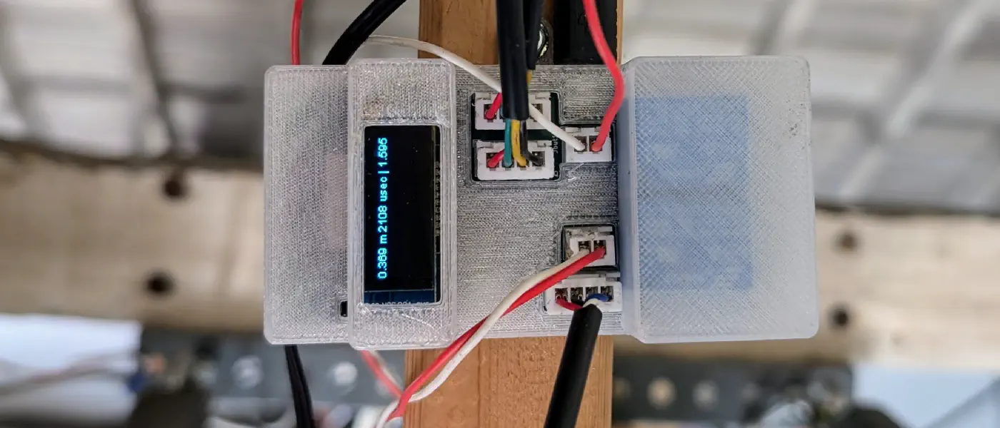
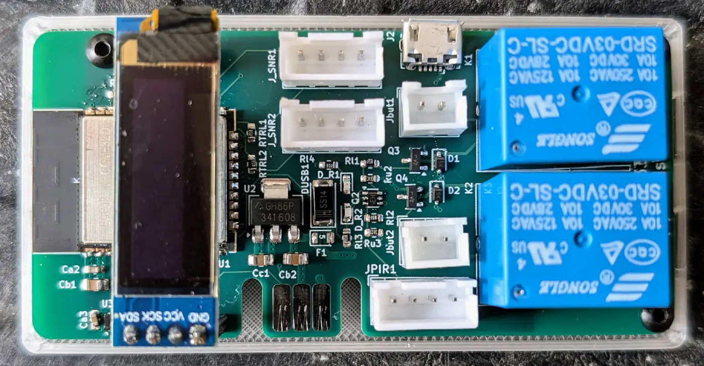
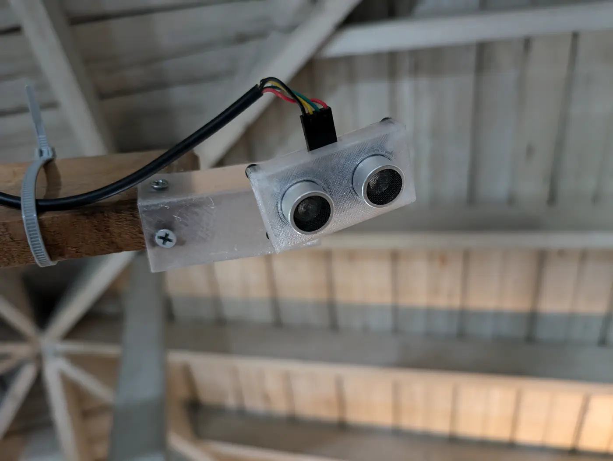

# Garage133

**Garage133** is a DIY garage door automation and monitoring system based on the ESP32.
It provides capability to remotely control up to two garage doors, monitor their
 state (open/closed), detect vehicle presence, measure environmental conditions
 (temperature/humidity), and detect motion within the garage.

The system is designed to integrate seamlessly with **Home Assistant** via MQTT
 but also provides a modern, responsive **Svelte-based Web Interface** for control and configuration.



## Features

*   **Dual Door Control:** Independent control for two garage doors using relays.
*   **HMM State Estimation:** Uses **Hidden Markov Models (HMM)** and sonar sensors to robustly determine door and car states:
    *   **Open** (Door is rolled up).
    *   **Closed with Car** (Door is down, vehicle detected).
    *   **Closed (Empty)** (Door is down, bay is empty).
*   **Modern Web Dashboard:** A responsive Svelte SPA to:
    *   Monitor real-time sensor data and door status.
    *   Trigger door relays remotely.
    *   Visualize HMM detection probabilities.
    *   Manually correct/label states to refine detection.
    *   Upload and reload HMM JSON models dynamically.
*   **Environmental Monitoring:** SHTC3 sensor for Temperature and Humidity.
*   **Motion Detection:** PIR sensor integration.
*   **Light Monitoring:** Analog light sensor to detect garage lighting levels.
*   **Home Assistant:** Native MQTT Discovery support for easy integration.
*   **OLED Display:** Shows status, IP address, and sensor readings locally.
*   **OTA Updates:** Support for reliable Over-The-Air firmware updates using expanded flash partitions.

## Hardware

The project is built around an **ESP32** (Node32s / ESP32 Dev Module).

### Pinout Configuration

| Component | Pin (ESP32) | Description |
| :--- | :--- | :--- |
| **Relay (Left)** | GPIO 15 | Control for Left Garage Door |
| **Relay (Right)** | GPIO 2 | Control for Right Garage Door |
| **Sonar Trigger (Left)** | GPIO 16 | HC-SR04 Trigger |
| **Sonar Echo (Left)** | GPIO 17 | HC-SR04 Echo |
| **Sonar Trigger (Right)** | GPIO 5 | HC-SR04 Trigger |
| **Sonar Echo (Right)** | GPIO 18 | HC-SR04 Echo |
| **PIR Sensor** | GPIO 25 | Motion Detection |
| **Light Sensor** | GPIO 33 | Analog Light Level |
| **I2C SDA** | GPIO 21 | SHTC3 & OLED Display |
| **I2C SCL** | GPIO 22 | SHTC3 & OLED Display |

*Note: Pin definitions can be found in `src/main.cpp`.*

### Fabrication
This repository includes files for fabricating the custom PCB and 3D printed case:
*   **KiCAD:** Circuit board designs are located in the `KiCAD/` directory.
*   **3D Parts:** OpenSCAD and STL files for the enclosure and sensor mounts are
     in the `scad/` directory.




## Getting Started

### Prerequisites
*   [PlatformIO](https://platformio.org/) (VSCode Extension or CLI)
*   [Node.js & npm](https://nodejs.org/) (For building the Web Interface)
*   Git

### Installation

1.  **Clone the repository:**
    ```bash
    git clone https://github.com/chl33/Garage133.git
    cd Garage133
    ```

2.  **Build the Web Interface:**
    Generate the C++ header containing the Svelte assets:
    ```bash
    ./build-svelte.sh
    ```

3.  **Configuration:**
    Copy the example secrets file and configure your environment settings.
    ```bash
    cp secrets.ini.example secrets.ini
    ```
    Edit `secrets.ini` to set your upload port, UDP log target, and OTA password.

-    *Note: WiFi and MQTT credentials can be configured via the captive portal on
-	 first boot, when you attach to the board's WiFi network named 'garage133.'
     They can be configured via the web dashboard therafter.*

4.  **Build and Flash:**
    Connect your ESP32 via USB for the first flash (to apply the `min_spiffs` partition table).
    ```bash
    pio run -e usb_node32s --target upload
    ```

## Usage

### Web Interface
Once connected to WiFi, navigate to the device's IP address in your browser.
*   **Overview:** Real-time status of both doors and environment.
*   **Door Details:** Click the Gear icon on a door card to see HMM probabilities, manually label the current state, or upload a new model.
*   **Settings:** Configure WiFi, MQTT, and restart the device.

### Home Assistant
Ensure your Home Assistant instance has an MQTT broker configured.
The device uses Home Assistant MQTT Discovery. Once the device connects to your MQTT broker, the following entities should automatically appear:
*   **Covers:** `left_door`, `right_door` (Open/Close control)
*   **Sensors:** `temperature`, `humidity`, `light`
*   **Binary Sensors:** `car` (presence for each bay), `motion`

### HMM Analysis Toolkit
The `analysis/` directory contains Python tools to help refine your detection models:
*   Download historical sonar data from InfluxDB, if you have this setup.
*   Train HMM models using the Viterbi algorithm.
*   Evaluate and export models to JSON for upload to the device.

## Blog Post
For a more detailed write-up on the background and design of this project, please see the [blog post](https://selectiveappeal.org/posts/garage133/).

## License
This project is licensed under the MIT License - see the [LICENSE](LICENSE) file for details.
