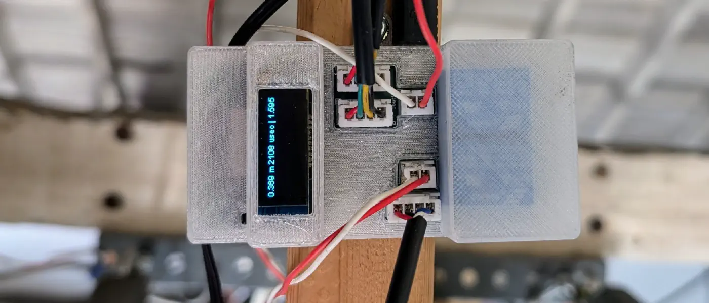
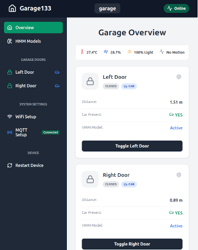
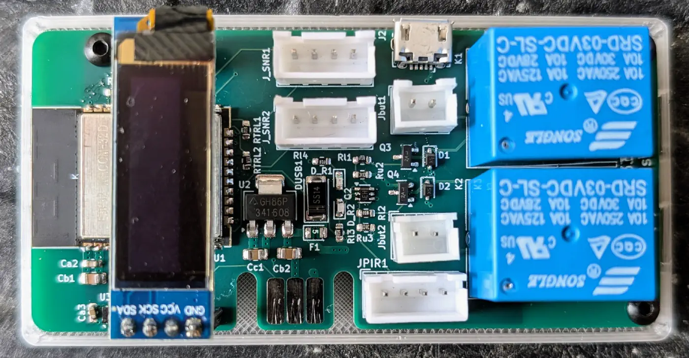
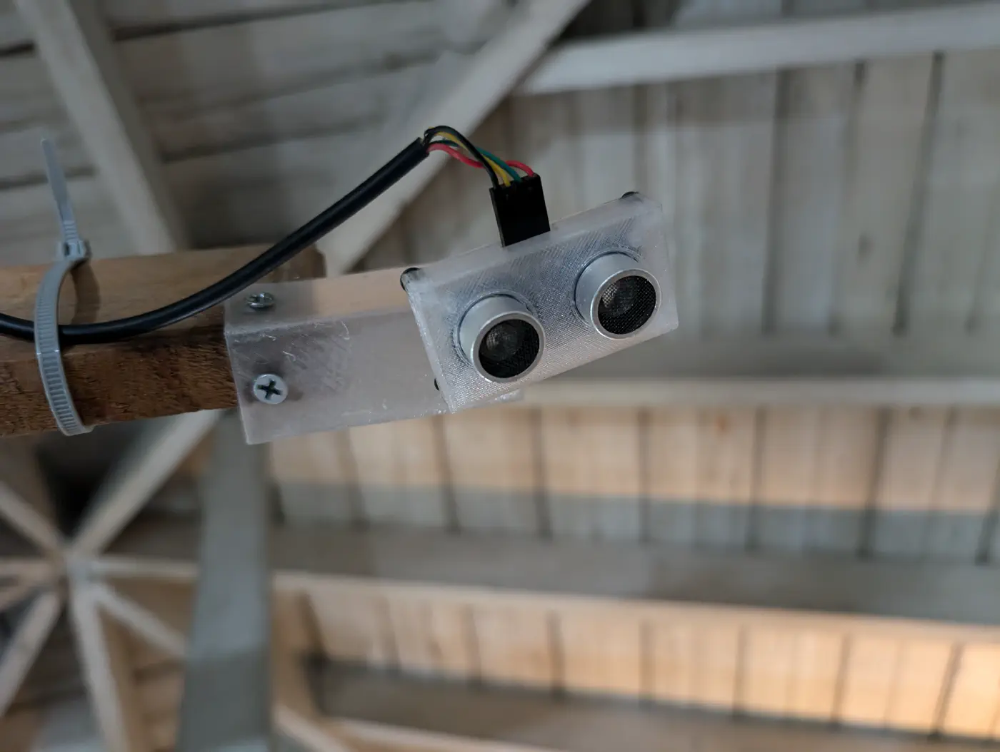

# Garage133

**Garage133** is a DIY garage door automation and monitoring system based on the ESP32 / ESP32-S3.
It provides the capability to remotely control up to two garage doors, monitor their
 state (open/closed), detect vehicle presence using a multi-sonar sensor array,
 measure environmental conditions (temperature/humidity), and detect motion within the garage.

The system integrates seamlessly with **Home Assistant** via MQTT Discovery
 and provides a modern, responsive **Svelte-based Web Interface** for real-time monitoring
 and configuration.



## What's New in v2.0.0

*   **Quad-Sonar Array (Dual Sonars per Bay)**: Upgraded from single to dual HC-SR04 ultrasonic sensors per garage door (4 sonars total), providing substantially more robust vehicle detection and door state estimation.
*   **Hardware Board v3.0 (ESP32-S3 Support)**: Added support for the v3.0 PCB powered by the ESP32-S3, featuring updated pin routings, 8MB flash support, and refreshed 3D solder stencil fixtures.
*   **Home Assistant Probability Sensors**: Added real-time HMM state probabilities (`probOpen`, `probCar`, `probEmpty`) to Home Assistant via MQTT Discovery.
*   **Hardened Web UI Build Pipeline**: Pinned `svelteesp32` to v3.2.5 and upgraded GitHub Actions workflows to Node 22 for reliable, deterministic builds.

## Features

*   **Dual Door Control:** Independent control for two garage doors using relays.
*   **Quad-Sonar HMM State Estimation:** Uses **Hidden Markov Models (HMM)** and a 4-sonar sensor array to robustly classify states:
    *   **Open** (Door is rolled up).
    *   **Closed with Car** (Door is down, vehicle present in bay).
    *   **Closed (Empty)** (Door is down, bay is empty).
*   **Modern Web Dashboard:** A responsive Svelte Single Page Application (SPA) to:
    *   Monitor real-time sensor data and door status.
    *   Trigger door relays remotely.
    *   Visualize HMM detection probabilities in real time.
    *   Manually correct and label states to refine detection.
    *   Upload and reload HMM JSON models dynamically.
*   **Environmental Monitoring:** SHTC3 sensor for Temperature and Humidity.
*   **Motion & Light Detection:** PIR sensor for motion and analog light sensor for garage illumination levels.
*   **Home Assistant MQTT Discovery:** Automatic entity discovery for covers, binary sensors, environmental gauges, and state probability metrics.
*   **OLED Display:** Shows live status, IP address, and sensor readings locally.
*   **OTA Updates:** Reliable Over-The-Air firmware updates using expanded flash partitions.



## Hardware

Garage133 supports both the **Board v3.0 (ESP32-S3)** and legacy/updated **Board v1/v2 (Classic ESP32)**.

### Pinout Configuration

| Component | Board v3.0 (ESP32-S3) | Board v1/v2 (Classic ESP32) | Description |
| :--- | :--- | :--- | :--- |
| **Relay (Left)** | GPIO 10 | GPIO 4 | Left Garage Door Relay Command |
| **Relay (Right)** | GPIO 11 | GPIO 19 | Right Garage Door Relay Command |
| **Sonar 1 Trig / Echo (Left)** | GPIO 1 / GPIO 5 | GPIO 16 / GPIO 17 | Primary Left Ultrasonic Sensor |
| **Sonar 2 Trig / Echo (Left)** | GPIO 3 / GPIO 7 | GPIO 23 / GPIO 26 | Secondary Left Ultrasonic Sensor |
| **Sonar 1 Trig / Echo (Right)** | GPIO 2 / GPIO 6 | GPIO 5 / GPIO 18 | Primary Right Ultrasonic Sensor |
| **Sonar 2 Trig / Echo (Right)** | GPIO 4 / GPIO 15 | GPIO 27 / GPIO 32 | Secondary Right Ultrasonic Sensor |
| **PIR Sensor** | GPIO 12 | GPIO 25 | PIR Motion Detection |
| **Light Sensor** | GPIO 12 | GPIO 33 | Analog Light Level |
| **I2C SDA / SCL** | GPIO 8 / GPIO 9 | GPIO 21 / GPIO 22 | SHTC3 Sensor & OLED Display |

*Note: Pin definitions are configured in [`src/main.cpp`](file:///home/chris/Projects2/Garage133/src/main.cpp).*

### Fabrication

This repository includes files for fabricating the custom PCB and 3D printed case:
*   **KiCAD:** Circuit board schematics and layouts are located in the `KiCAD/` directory.
*   **3D Parts:** OpenSCAD and STL files for the enclosure, sensor mounts, and solder stencil fixtures are in the `scad/` directory.




Sonar sensor mount design is also [published on Printables](https://www.printables.com/model/1741349-sonar-ball-and-socket-mount).

## Getting Started

### Prerequisites
*   [PlatformIO](https://platformio.org/) (VSCode Extension or CLI)
*   [Node.js & npm](https://nodejs.org/) (Node 22+ recommended for building the Web Interface)
*   Git

### Installation & Build

1.  **Clone the repository:**
    ```bash
    git clone https://github.com/chl33/Garage133.git
    cd Garage133
    ```

2.  **Build the Web Interface:**
    Generate the C++ header containing the compiled Svelte SPA:
    ```bash
    ./build-svelte.sh
    ```

3.  **Configuration:**
    Copy the example configuration files and customize your settings:
    ```bash
    cp secrets.ini.example secrets.ini
    cp local.ini.example local.ini
    ```
    *Note: WiFi and MQTT credentials can also be configured via the captive portal on first boot (when connected to the `garage133` AP) or through the web dashboard settings page.*

4.  **Build and Flash:**
    Connect your board via USB for the initial flash:

    *   **For ESP32-S3 (Board v3.0):**
        ```bash
        pio run -e usb_s3 --target upload
        ```
    *   **For Classic ESP32 (Board v1/v2):**
        ```bash
        pio run -e usb_node32s --target upload
        ```
    *   **For OTA updates (once configured on WiFi):**
        ```bash
        pio run -e wifi_node32s --target upload
        ```

## Usage

### Web Interface
Navigate to the device's IP address in your web browser:
*   **Overview:** Real-time status of both garage doors, ultrasonic distances, and environmental readings.
*   **Door Details:** View live HMM probability charts, manually label states to gather training data, or upload new JSON models.
*   **Settings:** Configure WiFi, MQTT broker, and initiate device restarts.

### Home Assistant Integration
The device automatically publishes Home Assistant MQTT Discovery topics:
*   **Covers:** `left_door`, `right_door` (Open/Close control & state feedback)
*   **Sensors:** `temperature`, `humidity`, `light`, `prob_open`, `prob_car`, `prob_empty`
*   **Binary Sensors:** `car` (vehicle presence per bay), `door`, `motion`

### HMM Analysis Toolkit
The `analysis/` directory contains Python tools to train and evaluate multi-sonar classification models:
*   Download historical telemetry logs from Home Assistant or InfluxDB.
*   Train 4-sonar HMM transition and emission models using the Viterbi algorithm.
*   Evaluate accuracy and export optimized JSON models to upload directly via the web UI.

## Blog Post
For background and detailed design notes on this project, check out the [Garage133 Blog Post](https://selectiveappeal.org/posts/garage133/).

## License
This project is licensed under the MIT License - see the [LICENSE](LICENSE) file for details.
