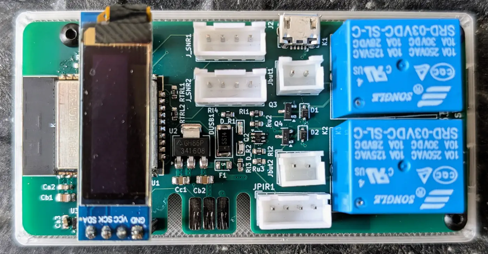

# Garage133

**Garage133** is a DIY garage door automation and monitoring system based on the ESP32.
It provides capability to remotely control up to two garage doors, monitor their
 state (open/closed), detect vehicle presence, measure environmental conditions
 (temperature/humidity), and detect motion within the garage.

The system is designed to integrate seamlessly with **Home Assistant** via MQTT
 but also provides a standalone Web Interface for control and configuration.


## Features

*   **Dual Door Control:** Independent control for two garage doors using relays.
*   **Smart State Detection:** Uses sonar sensors to determine if doors are:
    *   **Open** (Door is rolled up, sensor detects it nearby).
    *   **Closed with Car** (Door is down, sensor detects car).
    *   **Closed (Empty)** (Door is down, sensor sees floor).
*   **Environmental Monitoring:** SHTC3 sensor for Temperature and Humidity.
*   **Motion Detection:** PIR sensor integration.
*   **Light Monitoring:** Analog light sensor to detect garage lighting levels.
*   **Web Interface:** Built-in web server to view status, control doors, and configure WiFi/MQTT settings.
*   **Home Assistant:** Native MQTT Discovery support for easy integration.
*   **OLED Display:** Shows status, IP address, and sensor readings locally.
*   **OTA Updates:** Support for Over-The-Air firmware updates.

## Hardware

The project is built around an **ESP32** (Node32s / ESP32 Dev Module).

### Pinout Configuration

| Component | Pin (ESP32) | Description |
| :--- | :--- | :--- |
| **Relay (Left)** | GPIO 15 | Control for Left Garage Door |
| **Relay (Right)** | GPIO 2 | Control for Right Garage Door |
| **Sonar Trigger (Left)** | GPIO 16 | HC-SR04 Trigger |
| **Sonar Echo (Left)** | GPIO 17 | HC-SR04 Echo |
| **Sonar Trigger (Right)** | GPIO 5 | HC-SR04 Trigger |
| **Sonar Echo (Right)** | GPIO 18 | HC-SR04 Echo |
| **PIR Sensor** | GPIO 25 | Motion Detection |
| **Light Sensor** | GPIO 33 | Analog Light Level |
| **I2C SDA** | GPIO 21 | SHTC3 & OLED Display |
| **I2C SCL** | GPIO 22 | SHTC3 & OLED Display |

*Note: Pin definitions can be found in `src/main.cpp`.*

### Fabrication
This repository includes files for fabricating the custom PCB and 3D printed case:
*   **KiCAD:** Circuit board designs are located in the `KiCAD/` directory.
*   **3D Parts:** OpenSCAD and STL files for the enclosure and sensor mounts are
     in the `scad/` directory.




## Getting Started

### Prerequisites
*   [PlatformIO](https://platformio.org/) (VSCode Extension or CLI)
*   Git

### Installation

1.  **Clone the repository:**
    ```bash
    git clone https://github.com/chl33/Garage133.git
    cd Garage133
    ```

2.  **Configuration:**
    Copy the example secrets file and configure your environment settings.
    ```bash
    cp secrets.ini.example secrets.ini
    ```
    Edit `secrets.ini` to set your upload port, UDP log target, and OTA password.

    *Note: WiFi and MQTT credentials can be configured via the captive portal on
	 first boot.*

3.  **Build and Flash:**
    Connect your ESP32 via USB.
    ```bash
    pio run --target upload
    ```

4.  **Monitor:**
    To view serial output:
    ```bash
    pio device monitor
    ```

## Usage

### Web Interface
Once connected to WiFi, navigate to the device's IP address in your browser.
*   **Control:** Buttons to trigger Left/Right relays.
*   **Status:** View sensor data (Distance, Temp, Light).
*   **Config:** Links to configure WiFi and MQTT settings.

### Home Assistant
Ensure your Home Assistant instance has an MQTT broker configured.
The device uses Home Assistant MQTT Discovery. Once the device connects to your MQTT broker, the following entities should automatically appear:
*   **Covers:** `left_door`, `right_door` (Open/Close control)
*   **Sensors:** `temperature`, `humidity`, `light`
*   **Binary Sensors:** `car` (presence for each bay), `motion`

## Blog Post
For a more detailed write-up on the background and design of this project, please see the [blog post](https://selectiveappeal.org/posts/garage133/).

## License
This project is licensed under the MIT License - see the [LICENSE](LICENSE) file for details.
